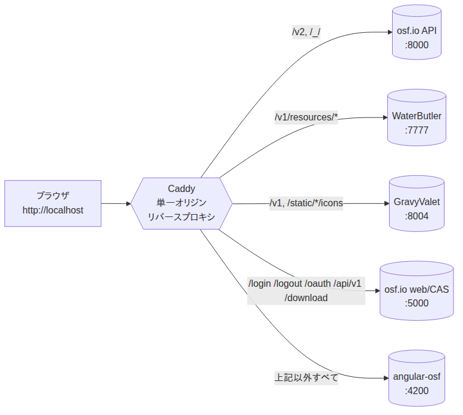
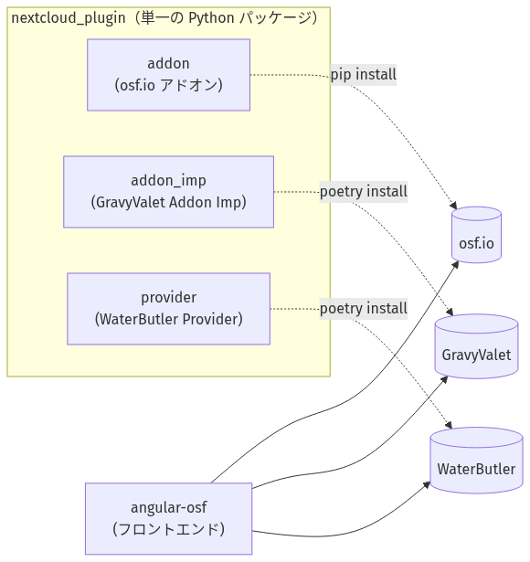
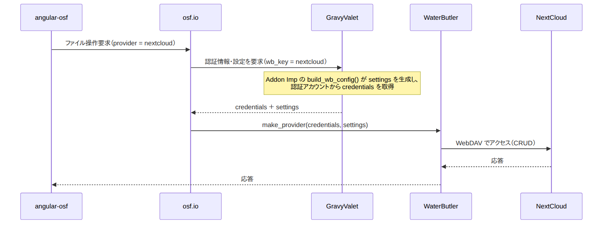
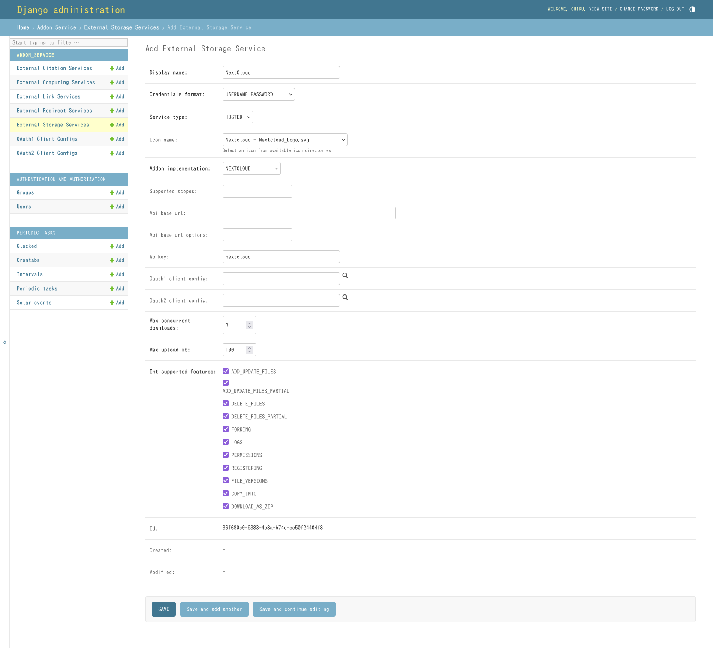

# ストレージアドオンの作成

具体的なストレージアドオンの例として、[NextCloud](https://nextcloud.com/)と接続するストレージアドオンを実装します。このアドオンをNextCloudアドオンと名付け、`nextcloud_plugin`という独立したPythonパッケージとして実装します。

本ドキュメントは以下の流れで構成されています。

1. **[開発環境の準備](#開発環境の準備)**: osf.io・GravyValet・WaterButler・angular-osf からなる開発環境を、[Caddy](https://caddyserver.com/)による単一オリジンプロキシとともに起動します。
2. **[ストレージアドオンの設計](#ストレージアドオンの設計)**: ストレージアドオンを構成する3要素(osf.io Addon / GravyValet Addon Imp / WaterButler Provider)とその実装方法を説明します。
3. **[ストレージアドオンの利用方法](#ストレージアドオンの利用方法)**: 作成したアドオンを各サービスにインストール・設定します。
4. **[NextCloud アドオンの動作確認](#nextcloud-アドオンの動作確認)**: NextCloud を接続先として、実際にファイル操作を試します。

本ガイドと合わせて、実装済みの参考例である [`nextcloud_plugin`](https://github.com/chiku-samugari/nextcloud_plugin) のソースコードを参照することを推奨します。

# 開発環境の準備

ストレージアドオンの開発に先立って、開発環境の準備方法を説明します。開発環境は以下の5つの要素から構成されます。

- **osf.io**: バックエンドの中核。ユーザ情報を保持し、WebサーバとAPIサーバを提供します。`osf.io` ディレクトリの Compose プロジェクトとして起動します。
- **GravyValet**: アドオンについての情報(接続先サービス・認証情報・設定)を管理します。`gravyvalet` ディレクトリの Compose プロジェクトとして起動します。
- **WaterButler**: ストレージサービスへのファイルアクセスを担います。`waterbutler` ディレクトリのCompose プロジェクトとして起動します。
- **angular-osf**: フロントエンド。`angular-osf` ディレクトリで `ng serve` により起動します。
- **Caddy**: 上記4サービスを単一オリジン(`http://localhost`)に束ねるリバースプロキシ(Dockerコンテナとして起動)。

このように、バックエンドを [osf.io](https://github.com/CenterForOpenScience/osf.io)・[GravyValet](https://github.com/CenterForOpenScience/gravyvalet)・[WaterButler](https://github.com/CenterForOpenScience/waterbutler) が、フロントエンドを [angular-osf](https://github.com/CenterForOpenScience/angular-osf) が担います。
[`RDM-osf.io` を中心とした従来の構成](../Environment.md)では、バックエンドとフロントエンド、すべてのサービスが1つの`docker-compose[.override].yml`(単一のComposeプロジェクト)にまとめられていましたが、本構成ではosf.io・GravyValet・WaterButler ・angular-osfはそれぞれ独立したリポジトリで扱い、それぞれのディレクトリで独立したDocker Composeプロジェクトとして起動します(angular-osfは`ng serve`(開発サーバ)で起動します)。
ブラウザから見ると、これらは本来別々のオリジンで動作します。しかしosf.io の認証(セッションCookie、CASのログイン往復、同一オリジンへのリダイレクト制約)は、フロントエンドとバックエンドが単一のオリジンで提供されることを前提としています。そこで開発環境では、[Caddy](https://caddyserver.com/)による**単一オリジンのリバースプロキシ**を`http://localhost`に立て、アクセスを各サービスへ振り分けます。



> **ブラウザ向けURLと、コンテナ間URLは別物です。** ブラウザ向けURLは `http://localhost`(Caddy 経由)に統一しますが、コンテナ間の通信(DB・CAS検証・サーバサイドのAPI/WB呼び出しなど)は、ループバックエイリアス `192.168.168.167`(osf.io のローカル開発の慣例)を用います。単一オリジンにするのは *ブラウザ向け* のみです。

## 前提条件・共通の準備

開発環境に以下のソフトウェアを準備します。

- **Docker**と**Docker Compose**
- **Node.js**と`npx`
- osf.io・GravyValet・WaterButler・angular-osf の各リポジトリを取得
- **ループバックエイリアス `192.168.168.167`** を設定

  ```bash
  $ sudo ifconfig lo:0 192.168.168.167 netmask 255.255.255.255 up
  ```

以降で追加する設定は、いずれもリポジトリにコミットされない**上書き用ファイル**(`docker-compose.override.yml`, `.docker-compose.local.env`, `config.json`, `Caddyfile` など)に記述します。追跡対象のファイルは upstream の値のまま変更しません。

## osf.io の準備と起動

`osf.io`ディレクトリで作業します。

### 設定の上書き

まずWebサーバとAPIサーバに関するDjangoの設定ファイル`local.py`を準備します。特に変更の必要がなければ、それぞれの`local-dist.py`をコピーして使用します。
```bash
$ cp api/base/settings/local-dist.py api/base/settings/local.py
$ cp website/settings/local-dist.py website/settings/local.py
```

`web` / `api` / `worker`は`.docker-compose.env`を読み込みます。このファイルはリポジトリの保持する内容から変えず、上書き用のenvファイル`.docker-compose.local.env`を以下の内容で作成します。

```dotenv
DOMAIN=http://localhost/
API_DOMAIN=http://localhost/
WATERBUTLER_URL=http://localhost
```

また、このファイルを`web` / `api` / `worker`が読み込むようにサービスの設定を上書きします。これも同様に、`osf.io/docker-compose.yml`を変更するのではなく、`osf.io/docker-compose.override.yml`を作ることで設定を上書きします。`osf.io/docker-compose.override.yml`を以下の内容で作成します。

```yaml
services:
  web:
    env_file: [.docker-compose.env, .docker-compose.local.env]
  api:
    env_file: [.docker-compose.env, .docker-compose.local.env]
  worker:
    env_file: [.docker-compose.env, .docker-compose.local.env]
```

### ライブラリのインストールとMigration

ライブラリのインストールとMigrationを実行するコマンドを実行します。1つ目については依存するライブラリが変更されたとき、2つ目についてはモデルなどのDB定義の定義に変更があった際に実行する必要があります。サービスの起動毎に毎回実行する必要があるものではありません。

```bash
# ライブラリのインストール(初回/依存定義の変更時)
$ docker compose up requirements

# DBのMigration(初回/DB定義の変更時)
$ docker compose run --rm web python3 manage.py migrate
```

### サービスの起動

以下のコマンドでストレージサービスアドオンの開発に必要なサービスを起動します。

```bash
$ docker compose up -d assets fakecas worker web api
```

なお、管理者機能が必要な場合には、`admin`と`admin_assets`を追加して起動してください。

```bash
$ docker compose up -d assets fakecas worker web api admin_assets admin
```

## GravyValet の準備と起動

`gravyvalet` ディレクトリで作業します。まず以下の内容で`docker-compose.override.yml`を作成します。

```yaml
services:
  gravyvalet:
    environment:
      OSF_BASE_URL: "http://localhost"
  celeryworker:
    environment:
      OSF_BASE_URL: "http://localhost"
  celerybeat:
    environment:
      OSF_BASE_URL: "http://localhost"
  postgres:
    image: postgres:17
```

GravyValetには`local.py`のフックがなく、環境変数がフックです。環境変数`OSF_BASE_URL`から、受理するリソースURIの接頭辞(`ALLOWED_RESOURCE_URI_PREFIXES`)を導出します。プロキシのオリジンを指定し、プロジェクト(`http://localhost/<guid>`)のリソースを認識させます。一方、`OSF_API_BASE_URL`はそのままにします。こちらはGravyValetがosf.io API を呼ぶ際に`192.168.168.167`エイリアス経由で使う値であり、ブラウザ向けではありません。

また、`docker-compose.yml`では`postgres`サービスのイメージとして`postgres:latest`を指定しており、起動できないケースが確認されています。`postgres:17`を指定しているのはそのための対処です。

続いて以下のコマンドで初期化を実施します。

```bash
$ docker compose up -d --build
$ docker compose exec gravyvalet python manage.py migrate
$ docker compose exec gravyvalet python manage.py fill_external_services
$ docker compose exec gravyvalet python manage.py createsuperuser
```

`migrate`はMigrationの実行で、初回以外にもモデルの追加や変更があったときに実行します。`fill_external_services`はGravyValetのコードベースに組み込まれているアドオン実装からExternalServiceを一通り作るコマンドで、組み込まれているストレージアドオン(S3やGoogleDriveなど)を利用することができるようになりますが、必須ではありません。`createsuperuser`によりGravyValetの管理者を作成し、`localhost:8004/admin`にブラウザでアクセスしてExternalServiceを追加することもできます。本ドキュメントで作成するアドオンからもExternalServiceを作る必要があるので、この管理者を作ることは必須です。普段の起動は`docker compose up -d`のみで十分です。

### 補足

- GravyValetのコンテナは`gravyvalet`という名前です。例えば、GravyValetのログは以下のようにして確認することができます。
  ```bash
  $ docker compose logs -f waterbutler
  ```

- Postgresは`postgres`コンテナで動作しており、DBを直接見たい場合はユーザを`postgres`、DBとして`gravyvalet`を指定します。
  ```bash
  $ docker compose exec postgres psql -U postgres -W gravyvalet
  ```

## WaterButler の準備と起動

`waterbutler` ディレクトリで作業します。WaterButlerリポジトリには`docker-compose.yml`が含まれていません。以下の内容の`docker-compose.yml`を作成します。

```yaml
services:
  waterbutler:
    build:
      context: .
    command: >
      bash -c "
        gosu www-data /code/.venv/bin/python -m invoke server
      "
    restart: unless-stopped
    env_file:
      - .docker-compose.env
    ports:
      - 7777:7777
    volumes:
      - ./:/code:cached
      - /code/.venv
    stdin_open: true
    depends_on:
      - celery

  celery:
    build:
      context: .
    command:
      gosu www-data /code/.venv/bin/python -m invoke celery
    restart: unless-stopped
    environment:
      C_FORCE_ROOT: 1
    env_file:
      - .docker-compose.env
    stdin_open: true
```

続いて、以下のコマンドで起動します。

```bash
$ docker compose up -d --build
```

### 補足

- WaterButlerのコンテナは`waterbutler`という名前です。例えばWaterButlerのログは以下のコマンドで確認することができます。
  ```bash
  $ docker compose logs -f waterbutler
  ```

## angular-osf の準備と起動

`angular-osf` ディレクトリで作業します。まず依存パッケージをインストールします。これは初回だけ実行します。

```bash
$ npm install
```

次に`src/assets/config/config.json`を以下の内容で作成します。このファイルは`.gitignore`によりgit管理から外されている設定ファイルです。これがないとangular-osfはステージング環境を指します。

```json
{
  "webUrl": "http://localhost",
  "apiDomainUrl": "http://localhost",
  "addonsApiUrl": "http://localhost/v1",
  "casUrl": "http://localhost:8080",
  "recaptchaSiteKey": "6LeIxAcTAAAAAJcZVRqyHh71UMIEGNQ_MXjiZKhI",
  "sentryDsn": "",
  "googleTagManagerId": "",
  "newRelicEnabled": false
}
```

開発サーバは**`development`**構成で起動します(i.e. `src/environments/environment.development.ts`)。

```bash
$ npx ng serve --configuration development --host 0.0.0.0 --port 4200 --poll 2000
```

## Caddyを用いた単一オリジンプロキシの起動

任意の場所に `Caddyfile`というファイルを以下の内容で作成します。

```caddyfile
{
	admin off
	auto_https off
}

http://localhost {
	# osf.io API (Django, :8000)
	@api path /v2 /v2/* /_/*
	handle @api { reverse_proxy 127.0.0.1:8000 }

	# WaterButler (ファイル操作) — /v1 より前に置くこと(GravyValet は /v1/resource-references を使う)
	@wb path /v1/resources/*
	handle @wb { reverse_proxy 127.0.0.1:7777 }

	# GravyValet (アドオンサービス, Django, :8004)
	@gv path /v1 /v1/*
	handle @gv { reverse_proxy 127.0.0.1:8004 }

	# GravyValet のアドオンアイコン
	@gvicons path /static/provider_icons/* /static/*/icons/*
	handle @gvicons { reverse_proxy 127.0.0.1:8004 }

	# osf.io web + CAS (Flask, :5000)
	@flask path /login /login/* /logout /logout/* /oauth /oauth/* /api/v1 /api/v1/* /download /download/*
	handle @flask { reverse_proxy 127.0.0.1:5000 }

	# angular-osf の開発サーバ (:4200) — Host は "localhost" のまま(localhost:4200 に書き換えない)
	handle { reverse_proxy 127.0.0.1:4200 }
}
```

このファイルが配置されたディレクトリで以下のコマンドを実行することで起動します。

```bash
$ docker run -d --name osf-proxy --restart unless-stopped --network host -v "$PWD/Caddyfile:/etc/caddy/Caddyfile:ro" caddy:2
```

## 起動手順のまとめ

起動の順序は ** エイリアス -> バックエンド -> フロントエンド -> プロキシ ** です。

```bash
# 0) ループバックエイリアス
$ sudo ifconfig lo:0 192.168.168.167 netmask 255.255.255.255 up

# 1) バックエンド
$ cd /path/to/osf.io       && docker compose up -d assets fakecas worker web api
$ cd /path/to/gravyvalet   && docker compose up -d
$ cd /path/to/waterbutler  && docker compose up -d

# 2) angular-osf の開発サーバ(別ターミナル。コンパイルに十数秒かかる)
$ cd /path/to/angular-osf
$ npx ng serve --configuration development --host 0.0.0.0 --port 4200 --poll 2000

# 3) プロキシ
$ cd /path/to/Caddyfile
$ docker start osf-proxy        # 初回は「単一オリジンプロキシ」の docker run を使用
```

## Web UIを開く・動作確認

ブラウザで **http://localhost/** を開きます。osf.io のホームページが表示され、`Sign in` から fakecas を経由してサインインできます。ダッシュボード・プロジェクト・ファイルの参照まで、すべて単一の `http://localhost` オリジンで提供されます。

簡易的なヘルスチェック:

```bash
$ curl -s -o /dev/null -w '%{http_code}\n' http://localhost/            # 200 (angular-osf)
$ curl -s -o /dev/null -w '%{http_code}\n' http://localhost/v2/         # 200 (API)
```

以上で開発環境の準備は完了です。

# ストレージアドオンの設計

## ストレージアドオンの構成

1つのストレージサービスを扱うために以下の**3要素**を実装します。

- **osf.io Addon**: osf.io上で動作するDjangoアプリケーション。ファイルとフォルダのモデルを持ち、アドオンの登録を担います。
- **GravyValet Addon Imp**: GravyValet上で動作するDjangoアプリケーション。フォルダ内容の一覧やWaterButler向け設定の生成を担います。
- **WaterButler Provider**: WaterButler上で動作する実装。実際のストレージへのアクセス、すなわちファイルの取得や移動・名称変更・削除といった処理を担います。

これら3要素を1つの独立したPythonパッケージにまとめ、各サービス(osf.io / GravyValet / WaterButler)へ`pip` / `poetry`でインストールして利用します。`osf.io` / `GravyValet` / `WaterButler`のソースコード内にアドオンを埋め込む必要はありません。実装済みの参考例としてNextCloudと接続するストレージアドオンである[`nextcloud_plugin`](https://github.com/chiku-samugari/nextcloud_plugin)パッケージとS3互換ストレージと接続するストレージアドオン[`s3compat_plugin`](https://github.com/chiku-samugari/s3compat_plugin)パッケージがあります。

> GravyValet導入前は「osf.io Addon」と「WaterButler Provider」の2要素でしたが、GravyValetの導入により「Addon Imp」が加わりました。Addon Impは通常はGravyValet本体に組み込まれますが、本ガイドではGravyValet本体を変更せずに動的にAddon Impを追加できる**Foreign Addon Imp**の仕組みを利用します。



## ファイルの構成

ストレージアドオンの典型的なレイアウトは以下のようになります。`nextcloud_plugin` を例としています。

```
nextcloud_plugin/
├── pyproject.toml        ... パッケージ定義、依存関係の宣言、WaterButlerエントリポイントの定義
├── README.md
└── src/nextcloud_plugin/
    ├── addon/            ... osf.io Addonパッケージ
    ├── addon_imp/        ... GravyValet Addon Impパッケージ
    └── provider/         ... WaterButler Providerパッケージ
```

### osf.io Addon のファイル構成

```
src/nextcloud_plugin/addon/
├── __init__.py              ... パッケージ初期化ファイル
├── apps.py                  ... アプリケーションの定義
├── models.py                ... FileNodeモデル3クラスと`UserSettings`, `NodeSettings`の定義
├── provider.py              ... 認証プロバイダの定義
├── serializer.py            ... Node/User設定をJSON化するシリアライザの定義
├── routes.py / views.py     ... View(Routes/Views)の定義
├── settings/                ... 設定モジュール
│   ├── __init__.py
│   └── defaults.py          ... デフォルト設定(ホストの Django settings から`getattr`で上書き可能)
├── typedmodel_workaround.py ... `TypedModelRejoinMixin`を提供
└── migrations/              ... このaddonのMigration(パッケージに同梱する)
```

> ストレージアドオンではフロントエンドを提供しません。接続・設定・フォルダ選択・ファイルブラウズのUIは`angular-osf`と`GravyValet`が提供します。従来必要だったアドオンごとのmakoテンプレート(`node_settings.mako`等)、`*-cfg.js` / `*Config.js`、Fangornのカスタマイズ、ログ表示用JSON(`*LogActionList.json`)、`storageAddons.json`への登録、JavaScriptメッセージの国際化(pybabel)などは不要です。

### GravyValet Addon Impのファイル構成

```
src/nextcloud_plugin/addon_imp/
├── __init__.py
├── apps.py                  ... アプリケーションの定義
├── imp.py                   ... AddonImpの実装
└── static/{AppConfig.name}/icons/  ... アドオンのアイコンを配置するディレクトリ
```

### WaterButler Providerのファイル構成

```
src/nextcloud_plugin/provider/
├── __init__.py
├── provider.py              ... Provider の定義
├── metadata.py              ... Metadata の定義
├── settings.py              ... デフォルト設定の定義
└── utils.py                 ... (必要に応じて)ユーティリティ
```

## 識別名について

ストレージアドオンでは1つのストレージサービスを表す**1つの識別名(例: `nextcloud`)**を3要素で一貫して使う必要があります。これらが一致していない場合、ファイル操作時にAddonやProviderの解決に失敗します。

|       識別子       |                    場所                       |    値の例   |
|:-------------------|:----------------------------------------------|:------------|
|    `short_name`    | osf.io AddonのAppConfig                       | `nextcloud` |
|     `_provider`    | osf.io AddonのFileNodeモデル                  | `nextcloud` |
|  `addon_imp_name`  | GravyValet Addon ImpのForeignAddonImpConfig   | `NEXTCLOUD` |
|      `wb_key`      | GravyValet のExternalStorageService           | `nextcloud` |
| エントリポイント名 | WaterButler Providerの`pyproject.toml`        | `nextcloud` |

より正確には以下の関係を満たす必要があります。

```
short_name == _provider == addon_imp_name.lower() == wb_key == WaterButler エントリポイント名
```

加えて、osf.io Addonにおいて以下の2つはいずれも`addons_<short_name>`という形式にする必要があります(例: `addons_nextcloud`)。

+ AppConfigの`label`クラス属性 ( 例: `NextcloudAddonAppConfig.label`)
+ FileNodeの`app_label`Metaオプション (例: `NextcloudFileNode.Meta.app_label`)

## osf.io Addonのモジュール構成

### AppConfig

`apps.py`に、`BaseAddonAppConfig`を継承した`AppConfig`を定義し、`name`、`short_name`([前章](#識別名について)を参照)、`label`(= `addons_<short_name>`)、`full_name`(画面表示用)を設定します。さらに、`ready()`メソッドで`rejoin_models()`を呼び出します。

NextCloudの場合は、`nextcloud_plugin`パッケージの [`src/nextcloud_plugin/addon/apps.py`](https://github.com/chiku-samugari/nextcloud_plugin/blob/main/src/nextcloud_plugin/addon/apps.py) を参照してください。要点は以下のとおりです。

```python
class NextcloudAddonAppConfig(BaseAddonAppConfig):
    name = 'nextcloud_plugin.addon'
    short_name = 'nextcloud'
    label = 'addons_nextcloud'
    full_name = 'Nextcloud'
    categories = ['storage']
    # ...

    def ready(self):
        super().ready()
        from .models import NextcloudFileNode, NextcloudFile, NextcloudFolder
        from .typedmodel_workaround import rejoin_models
        rejoin_models(NextcloudFileNode, NextcloudFile, NextcloudFolder)
```

### Model の構成

`models.py`に以下のModelを定義します。

- `UserSettings`: ユーザーに関する情報(認証情報等)
- `NodeSettings`: プロジェクトに関する情報
- `アドオン名FileNode`: ファイル・フォルダオブジェクトの親定義
- `アドオン名File`: ファイルオブジェクトの定義
- `アドオン名Folder`: フォルダオブジェクトの定義

ファイルノードの3クラス(`FileNode` / `File` / `Folder`)は、**明示的にプロキシモデル**として定義し、TypedModelに再登録する必要があります。具体的には以下のようにします。

- `アドオン名FileNode` の基底クラスに `TypedModelRejoinMixin` を含める。
- 3 クラスとも `Meta.proxy = True` を指定する。
- `アドオン名FileNode` に `_provider = '<short_name>'`、`db_owner = 'osf'`、`Meta.app_label = 'addons_<short_name>'` を設定する。

この手順に従うことで、[AppConfig.ready()](#appconfig)で呼び出す`rejoin_models()`がTypedModelへの再登録を実施します。

```python
class NextcloudFileNode(TypedModelRejoinMixin, BaseFileNode):
    _provider = 'nextcloud'
    db_owner = 'osf'
    class Meta:
        proxy = True
        app_label = 'addons_nextcloud'

class NextcloudFolder(NextcloudFileNode, Folder):
    class Meta:
        proxy = True

class NextcloudFile(NextcloudFileNode, File):
    version_identifier = 'version'
    class Meta:
        proxy = True
```

> `BaseFileNode`クラスはTypedModelで管理されていますが、そのままではMigrationがosf.io側に生成されてしまい、ストレージアドオンを独立したPythonパッケージとして配布できません。プロキシモデルに明示的な`app_label`を与えるとMigrationがストレージアドオン側に生成されますが、TypedModelはこのようなクラスの管理を止めてしまいます。`TypedModelRejoinMixin`と`ready()`内の`rejoin_models()`により、これらのクラスを`db_owner`(= `osf`)をキーとしてTypedModelのレジストリへ再登録し、この問題を回避しています。詳細は`nextcloud_plugin`の[`src/nextcloud_plugin/addon/typedmodel_workaround.py`](https://github.com/chiku-samugari/nextcloud_plugin/blob/main/src/nextcloud_plugin/addon/typedmodel_workaround.py)を参照してください。

`UserSettings`と`NodeSettings`は、OAuth認証をしない場合であってもそれぞれ`BaseOAuthUserSettings`と`BaseOAuthNodeSettings`(`NodeSettings`はさらに`BaseStorageAddon`)を継承し、`oauth_provider`に認証プロバイダクラス(`アドオン名Provider`)を指定します。認証プロバイダクラスは`provider.py`に定義します(`models.py`に定義されている場合もあります)。OAuthを用いる場合は`osf.models.external.ExternalProvider`を、ユーザー名・パスワードなどを用いる場合は`osf.models.external.BasicAuthProviderMixin`を継承します。NextCloudはWebDAVのユーザー名・パスワード認証を用いるため、後者を使用します。

NextCloudアドオンでの具体例は`nextcloud_plugin`パッケージの以下のファイルを参照してください。

- [`src/nextcloud_plugin/addon/models.py`](https://github.com/chiku-samugari/nextcloud_plugin/blob/main/src/nextcloud_plugin/addon/models.py)
- [`src/nextcloud_plugin/addon/provider.py`](https://github.com/chiku-samugari/nextcloud_plugin/blob/main/src/nextcloud_plugin/addon/provider.py)

### シリアライザ

`serializer.py`に`アドオン名Serializer`(`addons.base.serializer.StorageAddonSerializer`を継承)を定義します。これは、アドオンの`NodeSettings` / `UserSettings`を、設定画面やAPIが扱えるJSON形式に変換するものです。次節「Viewの構成」で用いる`addons.base.generic_views`は、このシリアライザを介して設定情報を入出力します。

主にシリアライズする情報は以下のとおりです。

- **接続先フォルダ**(`serialized_folder`): プロジェクトに紐付けたフォルダの名前とパス。
- **各種エンドポイントURL**(`addon_serialized_urls`): 認証情報の追加・一覧・インポート、認証解除、フォルダ一覧取得、設定保存などのURL。
- **Node設定 / User設定**(`serialized_node_settings` / `serialized_user_settings`): 認証状態や接続先などの設定値。

また、`credentials_are_valid()`により、保存された認証情報が有効か(実際にストレージへ接続できるか)を検証します。

NextCloudアドオンでの具体例は[`src/nextcloud_plugin/addon/serializer.py`](https://github.com/chiku-samugari/nextcloud_plugin/blob/main/src/nextcloud_plugin/addon/serializer.py)を参照してください。


### Viewの構成

`views.py`には、アドオンのアカウント設定やフォルダ取得などのエンドポイントを定義します。一部のViewは[シリアライザ](#シリアライザ)と`addons.base.generic_views`モジュールを利用することで簡潔に定義することができます。

```python
import_auth = addons.base.generic_views.import_auth(SHORT_NAME, Serializer)
```

`generic_views`で提供していないView処理を追加したい場合や、View処理をカスタマイズしたい場合は、以下のように`views.py`に個別の関数を定義します。

```python
@must_have_addon(SHORT_NAME, 'user')
@must_have_addon(SHORT_NAME, 'node')
def nextcloud_folder_list(node_addon, user_addon, **kwargs):
    """ Returns all the subsequent folders under the folder id passed.
        Not easily generalizable due to `path` kwarg.
    """
    path = request.args.get('path')
    return node_addon.get_folders(path=path)
```

NextCloud の場合の具体例は、`nextcloud_plugin` パッケージの以下のファイルを参照してください。

- [`src/nextcloud_plugin/addon/routes.py`](https://github.com/chiku-samugari/nextcloud_plugin/blob/main/src/nextcloud_plugin/addon/routes.py)
- [`src/nextcloud_plugin/addon/views.py`](https://github.com/chiku-samugari/nextcloud_plugin/blob/main/src/nextcloud_plugin/addon/views.py)

### 設定モジュール

ストレージアドオンごとの固有の設定は`settings/defaults.py` で定義とデフォルト値を設定し、osf.ioのDjango settings から`getattr` で上書きする形で読み込むようにします。これにより、サービス管理者がパッケージの中身を編集することなく、`api/base/settings/local.py`で設定を上書きできます。したがって、これらの設定項目はREADMEに明記する必要があります。

```python
# src/nextcloud_plugin/addon/settings/defaults.py
from django.conf import settings as _osf

USE_SSL         = getattr(_osf, 'NEXTCLOUD_USE_SSL', True)
MAX_UPLOAD_SIZE = getattr(_osf, 'NEXTCLOUD_MAX_UPLOAD_SIZE', 5 * 1024)
```

> 接続先ホストや「選択可能なホストの一覧」などの**サービス単位の設定は、GravyValetの`ExternalStorageService`で管理します**。`ExternalStorageService`はAddon Impなどを元に作られる、DB上のデータです。つまり、そのようなデータはソースコードの形では保持しません。

### Migration

FileNodeモデルが必要とするMigrationを以下の手順で作成し、パッケージに同梱します。

1. osf.io AddonのMigration以外の部分を完成させる
2. 開発環境のosf.ioにosf.io Addonをインストールする
    - インストール方法は[ストレージアドオンの利用方法](#ストレージアドオンの利用方法)を参照
3. `makemigrations`を**アプリケーションラベル(`addons_<short_name>`)を明示して**実行する
    - `docker compose run --rm web python3 manage.py makemigrations addons_nextcloud`
4. 生成されたMigrationファイルからosf側への依存(`('osf', '0XXX_...')`)を手作業で取り除き、ストレージアドオンの一部として`addon/migrations/`に配置してパッケージに同梱する
    - osf.ioの特定のMigration履歴にストレージアドオンパッケージを固定しないため

## GravyValet Addon Impのモジュール構成

GravyValet Addon Impは、`gravyvalet.addon_toolkit.interfaces.storage`の`StorageAddonHttpRequestorImp`(HTTPベース)または`StorageAddonClientRequestorImp[T]`(クライアントライブラリベース)を継承して実装します。GravyValet本体に組み込まれた既存のAddon Imp(`gravyvalet/addon_imps/storage/*.py`)は良い実装例です。例えばNextCloudはWebDAV を用いるため、`owncloud.py`のAddon Impが近い実装例となります。

`apps.py`には`ForeignAddonImpConfig`を継承したAppConfigを定義し、以下を実装・設定します。

- `imp`: AddonImp 実装クラスを返すプロパティ。
- `addon_imp_name`: このAddon Impの一意な識別名(大文字、例: `NEXTCLOUD`)を返すプロパティ。`addon_service.common.known_imps.KnownAddonImps`に列挙された名前、および既存のストレージアドオンで使われている値と衝突しない値を返します。
- `name`: Djangoアプリのインポートパス(例: `nextcloud_plugin.addon_imp`)。アイコンの静的ファイルは`static/{name}/icons/` に配置します。
- `label`: Django アプリのラベル。**一意な値を明示的に設定します**(例: `nextcloud_addon_imp`)。Django はラベルを省略するとパスの末尾(`addon_imp`)を使うため、これを省略したストレージアドオンを複数使うとGravyValet が起動できなくなります。

```python
class NextcloudForeignAddonImpConfig(ForeignAddonImpConfig):
    name = "nextcloud_plugin.addon_imp"
    label = "nextcloud_addon_imp"

    @property
    def imp(self):
        return NextcloudStorageImp

    @property
    def addon_imp_name(self):
        return "NEXTCLOUD"
```

`addon_imp_name`と`name` の値はREADME にも明記する必要があります。`addon_imp_name`はサービス管理者がこのストレージアドオンを設定する際に利用する値であり、サービス管理者が知る必要のある値です。`name`は他の同様なストレージアドオンパッケージが同じ値を使うことを避ける必要があり、ストレージアドオンの開発者が知る必要のある値です。

`imp.py`で定義するAddon Imp本体ではストレージのブラウズ(`list_root_items` / `list_child_items` / `get_item_info`)や認証検証(`get_external_account_id`)などを実装します。また、`build_wb_config()` メソッドで、WaterButler Provider に渡す設定(`settings`)を生成します。NextCloud の場合、接続先フォルダ・ホスト・SSL 検証フラグを返します。

```python
async def build_wb_config(self) -> dict:
    # ...
    return {
        "folder": f"/{folder_path}",
        "host": root_host,
        "verify_ssl": True,
    }
```

具体的な実装例は`nextcloud_plugin` パッケージの以下のファイルを参照してください。

- [`src/nextcloud_plugin/addon_imp/apps.py`](https://github.com/chiku-samugari/nextcloud_plugin/blob/main/src/nextcloud_plugin/addon_imp/apps.py)
- [`src/nextcloud_plugin/addon_imp/imp.py`](https://github.com/chiku-samugari/nextcloud_plugin/blob/main/src/nextcloud_plugin/addon_imp/imp.py)

## WaterButler Providerのモジュール構成

WaterButler ProviderはWaterButlerが提供する`waterbutler.core.provider.BaseProvider`を継承して実装します。`metadata.py`にはフォルダ・ファイルのメタデータとリビジョンを表すクラスを、`provider.py`にはストレージへ接続し CRUD 操作を行うProviderクラスを定義します。

Provider が提供する主なメソッドは以下のとおりです。

| 関数名 | 引数 | 戻り値 | 処理 |
|:------|:----|:------|:-----|
| `validate_v1_path` | path, **kwargs | WaterButlerPath | 文字列で与えられたパス情報(`path`)を検証し、属性付きの WaterButlerPath オブジェクトを返す。 |
| `validate_path` | path, **kwargs | WaterButlerPath | 同上(廃止予定の v0 仕様との互換性維持のため、2 つのメソッドに分かれている)。 |
| `download` | path, accept_url=False, version=None, range=None, **kwargs | Stream | 指定されたパス(`path`)のデータをダウンロードする。戻り値にはデータアクセス用の Stream を返す。 |
| `upload` | stream, path, conflict='replace', **kwargs | Metadata | 指定されたパス(`path`)に指定されたデータ(`stream`)をアップロードする。戻り値にはアップロードしたファイルを示す Metadata を返す。 |
| `delete` | path, confirm_delete=0, **kwargs | なし | 指定されたパス(`path`)のファイル・フォルダを削除する。 |
| `revisions` | path, **kwargs | List(Revision) | 指定されたパス(`path`)のリビジョン情報を取得する。 |
| `metadata` | path, revision=None, **kwargs | Metadata or List(Metadata) | 指定されたパス(`path`)のメタデータを取得する。`path` が file の場合 `Metadata`、directory の場合 `List(Metadata)` を返す。 |
| `create_folder` | path, folder_precheck=True, **kwargs | Metadata | 指定されたパスにフォルダを作成する。戻り値には作成したフォルダを示す Metadata を返す。 |
| `can_intra_copy` | dest_provider, path=None | Bool | 指定された送信先 Provider(`dest_provider`), パス(`path`)に対して intra_copy(内部コピー: ストレージサービス上でのコピー)が可能かどうかを判定する。これが False の場合、いったん一時ディレクトリに download して dest に upload する操作となる。 |
| `can_intra_move` | dest_provider, path=None | Bool | 指定された送信先 Provider(`dest_provider`), パス(`path`)に対して intra_move(内部移動: ストレージサービス中での移動)が可能かどうかを判定する。これが False の場合、いったん一時ディレクトリに download し dest に upload、コピー元ファイルを delete する操作となる。 |
| `intra_copy` | dest_provider, src_path, dest_path | Bool | 内部コピーを実施する。成功すれば True を返す。 |
| `intra_move` | dest_provider, src_path, dest_path | Bool | 内部移動を実施する。成功すれば True を返す。 |

Providerクラスの`NAME`には[前述の識別名](#識別名について)を指定します(例: `nextcloud`)。

```python
class NextcloudProvider(provider.BaseProvider):
    NAME = 'nextcloud'

    def __init__(self, auth, credentials, settings, **kwargs):
        super().__init__(auth, credentials, settings, **kwargs)
        self.folder = settings['folder']
        self.verify_ssl = settings['verify_ssl']
        self.url = credentials['host']
        self._auth = aiohttp.BasicAuth(credentials['username'], credentials['password'])
```

WaterButlerは`pyproject.toml`の`[tool.poetry.plugins."waterbutler.providers"]`に登録されたエントリポイントからProviderを発見します。**このエントリポイント名が、[前述の識別名](#識別名について)になります。**

```toml
[tool.poetry.plugins."waterbutler.providers"]
nextcloud = "nextcloud_plugin.provider.provider:NextcloudProvider"
```

NextCloud での実装例は`nextcloud_plugin` パッケージの以下のファイルを参照してください。

- [`src/nextcloud_plugin/provider/provider.py`](https://github.com/chiku-samugari/nextcloud_plugin/blob/main/src/nextcloud_plugin/provider/provider.py)
- [`src/nextcloud_plugin/provider/metadata.py`](https://github.com/chiku-samugari/nextcloud_plugin/blob/main/src/nextcloud_plugin/provider/metadata.py)

## 認証情報・設定情報の委譲

WaterButler Providerが実際のストレージに接続するには、認証情報(`credentials`)と設定情報(`settings`)が必要です。本ドキュメントの想定する構成においてはこれらは**GravyValetが管理し、WaterButlerへ渡します**(従来の構成ではosf.io Addonの`NodeSettings.serialize_waterbutler_credentials()` / `serialize_waterbutler_settings()`が担っていました)。



- 設定情報(`settings`)はGravyValet Addon Impの`build_wb_config()`が生成
    - NextCloud の場合は接続先フォルダ・ホスト・SSL 検証フラグ
- 認証情報(`credentials`)はGravyValet が管理する認証アカウント(ユーザーが接続時に入力した値)から渡される
    - NextCloud の場合はホスト・ユーザー名・パスワード

WaterButler Provider側では、コンストラクタ(`__init__`)の引数`credentials`と`settings`に、それぞれDictionary型で受け取ります。NextCloudの場合は以下のように受け取ります。

```python
def __init__(self, auth, credentials, settings, **kwargs):
    super().__init__(auth, credentials, settings, **kwargs)
    self.folder = settings['folder']        # build_wb_config() が生成
    self.verify_ssl = settings['verify_ssl'] # build_wb_config() が生成
    self.url = credentials['host']           # GravyValet のアカウントから
    self._auth = aiohttp.BasicAuth(credentials['username'], credentials['password'])
```

## Recent Activity の記録

何らかのユーザー操作を契機としてアドオンに対して行われた操作は、Recent Activity という形で記録できます。Recent Activityは[NodeLog モデル](https://github.com/CenterForOpenScience/osf.io/blob/develop/osf/models/nodelog.py) により表現され、Node(プロジェクトに対応するモデル)の`add_log`メソッドで記録します。

```python
self.owner.add_log(
    '{0}_{1}'.format(SHORT_NAME, action),
    auth=auth,
    params={
        'project': self.owner.parent_id,
        'node': self.owner._id,
        'path': metadata['materialized'],
        'folder': self.folder_id,
        'urls': {
            'view': url,
            'download': url + '?action=download',
        },
    },
)
```

- `action` ... ログのアクション種別。`アドオン名_アクション名` の形式。
- `params` ... ログのパラメータ。任意の dict を指定できる。
- `auth` ... 操作を実施したユーザーの情報([framework.auth.Auth クラス](https://github.com/CenterForOpenScience/osf.io/blob/develop/framework/auth/core.py) のインスタンス)。

> ログの表示(どのメッセージをどう描画するか)は`angular-osf`フロントエンドが担当します。`RDM-osf.io`の`アドオン名LogActionList.json` / `アドオン名AnonymousLogActionList.json`やpybabel によるJavaScriptメッセージの国際化は不要です。

# ストレージアドオンの利用方法

作成したストレージアドオンは独立したPythonパッケージなので、`pip`や`poetry`を利用して各サービスにインストールします。特に、osf.io Addonのための[Migrationを作成する必要がある](#migration)ので、ここでは開発環境へのインストール方法を、NextCloud用のストレージアドオンパッケージである[`nextcloud_plugin`](https://github.com/chiku-samugari/nextcloud_plugin)を例にとって説明します。[開発環境の準備](#開発環境の準備)のガイドに従って開発環境にてosf.io, GravyValet, WaterButler, angular-osfを起動しているものとします。特に、osf.io, GravyValet, WaterButlerがそれぞれのディレクトリ、すなわち独立したComposeプロジェクトとして起動されている前提であることに注意してください。

## osf.io

本節での作業は`osf.io`ディレクトリにて実施します。

1. `docker-compose.override.yml`に、`nextcloud_plugin`のコードベースをボリュームとして追加
    ```
    services:
      web:
        volumes:
          - /path/to/nextcloud_plugin/:/nextcloud_plugin:cached
      api:
        volumes:
          - /path/to/nextcloud_plugin/:/nextcloud_plugin:cached
      worker:
        volumes:
          - /path/to/nextcloud_plugin/:/nextcloud_plugin:cached
    ```

2. ストレージアドオンパッケージを`api`/`web`/`worker`コンテナにインストール
    - `docker compose exec web pip install -e /nextcloud_plugin`
    - `docker compose exec api pip install -e /nextcloud_plugin`
    - `docker compose exec worker pip install -e /nextcloud_plugin`

3. `api/base/settings/local.py`の`INSTALLED_APPS`に、osf.io Addonパッケージを追加

   ```python
   INSTALLED_APPS += ('nextcloud_plugin.addon',)
   ```

ここで使う値はAppConfigの`name`の値です。

4. `api/base/settings/local.py`の`ADDONS_FOLDER_CONFIGURABLE`に、`short_name`の値を追加

   ```python
   ADDONS_FOLDER_CONFIGURABLE += ['nextcloud']
   ```

5. `addons.json`の`addons`リストに`short_name`の値を追加する

   ```json
   "addons": [ ..., "nextcloud" ],
   ```

必要に応じて `addons_archivable` 等にも追加します。

6. サービスを再起動する
    - `docker compose restart`

> GravyValetを利用する場合、`storageAddons.json`への追記は不要です。

## GravyValet

本節の作業は`gravyvalet`ディレクトリにて実施します。

1. `docker-compose.override.yml`に、`nextcloud_plugin`のコードベースをボリュームとして追加
    ```
    services:
      gravyvalet:
        volumes:
          - /path/to/nextcloud_plugin/:/nextcloud_plugin:cached
    ```
2. ストレージアドオンパッケージを`gravyvalet`コンテナにインストール
    - `docker compose exec gravyvalet poetry add --editable /nextcloud_plugin`

3. `app/settings.py`の`INSTALLED_APPS`に、Addon Impのパッケージ(`name`)を追加

   ```python
   INSTALLED_APPS += ('nextcloud_plugin.addon_imp',)
   ```

4. `app/settings.py`の`ADDON_IMPS`にエントリを追加する。**キーは`addon_imp_name`(`"NEXTCLOUD"`)、値は一意な5000以上の整数**(パッケージ名をキーにしないこと。前述の[命名規則](#識別名について)の注意を参照)。

   ```python
   ADDON_IMPS = {
       # ...
       "NEXTCLOUD": 5001,
   }
   ```

5. GravyValetのサービスを再起動します。
    - `docker compose restart`

6. GravyValetの管理画面`localhost:8004/admin`から、NextCloud用の`ExternalStorageService`を作成します。**`wb_key`には`short_name`の値(`"nextcloud"`)を指定します**(= WaterButlerのエントリポイント名)。NextCloudのように接続先ホストをユーザーごとに入力させる場合、Service Typeを`HOSTED`とし、`api_base_url`は空にします。また、NextCloudはユーザ名とパスワードでの認証を用いるのでCredentials Formatとしては`USERNAME_PASSWORD`を指定します。



## WaterButler

1. `docker-compose.override.yml`に、`nextcloud_plugin`のコードベースをボリュームとして追加
    ```
    services:
      waterbutler:
        volumes:
          - /path/to/nextcloud_plugin/:/nextcloud_plugin:cached
    ```

2. ストレージアドオンパッケージを`waterbutler`コンテナにインストール
    - `docker compose exec waterbutler poetry add --editable /nextcloud_plugin`

3. WaterButlerのサービスを再起動
    - `docker compose restart`

> **明示的な再起動が必須です。** editable installでは、パッケージへのパスを記した`.pth`ファイルがインタプリタ起動時にのみ読み込まれます。そのため起動済みのプロセスはインストール後も新しいProviderを認識せず(`ProviderNotFound`となる)、必ずプロセスを再起動する必要があります。

Providerは`waterbutler.providers`エントリポイントから自動的に発見されます。

# NextCloud アドオンの動作確認

NextCloud アドオンの動作確認をしてみましょう。

## NextCloud サービスの起動

接続先のNextCloudサービスを起動します。動作確認にはNextCloud公式のDockerイメージが手軽です。

```
$ docker run -d --name nextcloud-test -p 8081:80 nextcloud:stable
```

ブラウザで `http://localhost:8081` を開き、セットアップウィザードに従って管理者ユーザーを作成します。

> WaterButler / GravyValetの各コンテナからNextCloudへ到達できる必要があります。osf.ioと同じホストで実行する場合は、`localhost`ではなくコンテナから到達可能なアドレス(osf.ioのローカル開発で用いるループバックエイリアス`192.168.168.167`など)を使用します。また、NextCloud側の`trusted_domains`に、そのアドレス(例: `192.168.168.167:8081`)を追加する必要がある場合があります。

## ExternalStorageServiceの作成

前述の「[ストレージアドオンの利用方法](#gravyvalet)」に従い、`ExternalStorageService`を作成します(`wb_key`は`nextcloud`、Credentials Formatは`USERNAME_PASSWORD`, Service Typeは`HOSTED`、`api_base_url` は空)。

## ストレージアドオンを試す

angular-osf の画面から、以下のような操作を実施します。

1. アカウント設定画面で、NextCloud アドオンのアカウントを接続します。`Host URL` には NextCloud のホスト(例: `http://192.168.168.167:8081/`)、ユーザー名・パスワードには NextCloud のログイン情報を入力します。
2. 適当なプロジェクトを作成し、NextCloud アドオンを有効化します。
3. フォルダピッカーで、プロジェクトに紐付けるフォルダを選択します。
4. プロジェクトのFilesから、NextCloudに対してフォルダ作成・アップロード・ダウンロード・削除・移動・コピーなどができることを確認します。

以上でNextCloudアドオンの動作確認は完了です。
